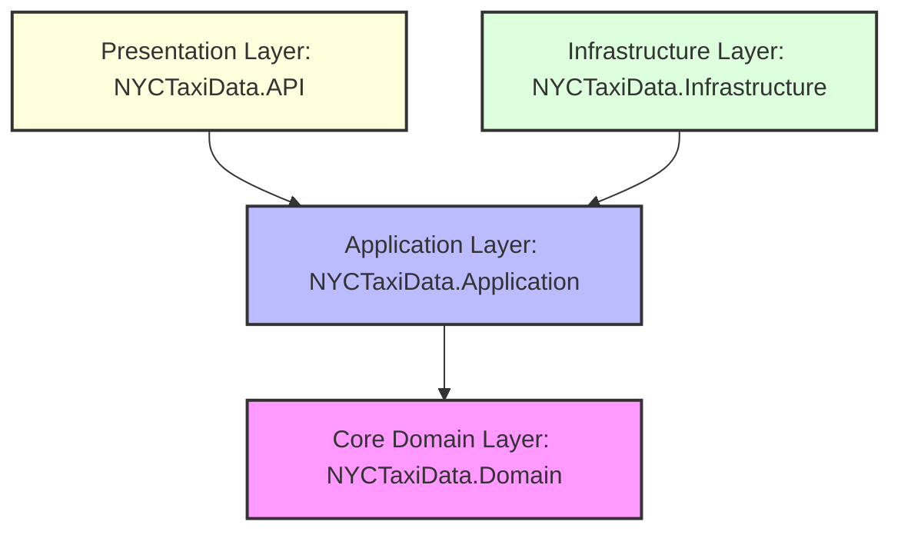

# NYCTaxiData — Enterprise taxi operations & simulation platform

NYCTaxiData is a highly scalable, real-time backend platform and digital twin engine for NYC taxi fleet management and demand operations. Built on **.NET 10** using a strict **Clean Architecture** model, the platform leverages **feature-first CQRS**, a custom 11-stage **MediatR middleware pipeline**, and **SignalR WebSockets** for live event streaming.

The system is equipped with a faster-than-real-time (FTRT) operational simulation engine, geographic geo-spatial metrics calculators, external AI forecasting clients with automatic resilience retry policies, and an interactive React 19 TypeScript monitoring dashboard.

---

## 🗺️ System Architecture

The repository enforces a modular **Clean Architecture** layout. Dependencies flow inward toward the core domain logic, isolating business rules from data persistence, external integrations, and API controllers.



### Layer Responsibilities

*   **`NYCTaxiData.Domain` (Core)**: 
    *   Holds pure business models and domain entities (e.g., `Trip`, `Driver`, `Zone`, `User`).
    *   Exposes base domain interfaces, custom enums (`CurrentStatus`, `UserRole`), and generic repository contracts (`IGenericRepository<T>`).
    *   Decoupled from all databases, frameworks, or web APIs.
*   **`NYCTaxiData.Application`**: 
    *   Contains the application logic organized into **Feature-First CQRS** modules.
    *   Houses MediatR Command and Query handlers, mapping profiles, DTO definitions, and validation logic (`FluentValidation`).
    *   Implements the custom request processing pipeline (Pipeline Behaviors) to inject cross-cutting behaviors across all commands and queries.
*   **`NYCTaxiData.Infrastructure`**: 
    *   Manages data persistence via EF Core (`TaxiDbContext`) mapping to PostgreSQL, handling entity auditable tracking and transaction interceptors.
    *   Integrates external integrations: Twilio WhatsApp SMS clients, memory/distributed caching, JWT token generators, and the Polly-resilient AI forecasting HTTP adapter.
    *   Encapsulates the operational simulation engine (features, transitions, rules, result stores, and state managers).
*   **`NYCTaxiData.API` (Presentation)**: 
    *   Exposes secure REST endpoints through structured controllers inheriting from `BaseController`.
    *   Hosts SignalR Hub services (`TaxiHub`, `LiveTrackingHub`, `DispatchHub`, and `SimulationHub`) for server-to-client notifications.
    *   Wires startup dependencies, CORS configurations, global exception-handling middleware, and OpenAPI setups.

---

## ⚡ Request Processing Pipeline (MediatR Behaviors)

Every CQRS request dispatched through MediatR enters an ordered 11-stage pipeline, acting as application-level middleware to enforce system-wide security, resilience, validation, and monitoring:

```text
       Incoming MediatR Command / Query
                      │
   ┌──────────────────▼──────────────────┐
   │ [1] ExceptionHandlingBehavior       │ ◄── Catches & formats exceptions globally
   └──────────────────┬──────────────────┘
   ┌──────────────────▼──────────────────┐
   │ [2] MetricsBehavior                 │ ◄── Captures operation execution counters
   └──────────────────┬──────────────────┘
   ┌──────────────────▼──────────────────┐
   │ [3] PerformanceBehavior             │ ◄── Monitors slow tasks & degradation history
   └──────────────────┬──────────────────┘
   ┌──────────────────▼──────────────────┐
   │ [4] LoggingBehavior                 │ ◄── Structure-logs inputs and parameters
   └──────────────────┬──────────────────┘
   ┌──────────────────▼──────────────────┐
   │ [5] AuthorizationBehavior           │ ◄── Checks token claims & user roles
   └──────────────────┬──────────────────┘
   ┌──────────────────▼──────────────────┐
   │ [6] ValidationBehavior              │ ◄── Executes FluentValidation rules
   └──────────────────┬──────────────────┘
   ┌──────────────────▼──────────────────┐
   │ [7] CachingBehavior                 │ ◄── Fetches cache if marked with ICacheableQuery
   └──────────────────┬──────────────────┘
   ┌──────────────────▼──────────────────┐
   │ [8] IdempotencyBehavior             │ ◄── Prevents duplicate command replays
   └──────────────────┬──────────────────┘
   ┌──────────────────▼──────────────────┐
   │ [9] RetryBehavior                   │ ◄── Retries transient pipeline errors
   └──────────────────┬──────────────────┘
   ┌──────────────────▼──────────────────┐
   │ [10] TimeoutBehavior                │ ◄── Enforces request execution deadlines
   └──────────────────┬──────────────────┘
   ┌──────────────────▼──────────────────┐
   │ [11] TransactionBehavior            │ ◄── Wires EF Core database transaction limits
   └──────────────────┬──────────────────┘
                      │
            Target Feature Handler
```

### Key Behaviors Highlighted

*   **`PerformanceBehavior<TRequest, TResponse>`**:
    *   Detects operations running slower than targets (Queries: 500ms, Commands: 1000ms).
    *   Tracks execution history in a thread-safe sliding window (100 measurements).
    *   Monitors relative performance degradation (triggering warnings upon a 20% latency increase).
    *   Exposes runtime query functions (`GetSlowOperations()`, `GetDegradingOperations()`, `GetPerformanceHistory()`).
*   **Pipeline Markers**: Request routing is controlled dynamically through marker interfaces:
    *   `ISecureRequest`: Intercepted by `AuthorizationBehavior`.
    *   `IIdempotentCommand`: Intercepted by `IdempotencyBehavior` to eliminate duplicate writes.
    *   `ICacheableQuery`: Intercepted by `CachingBehavior` for instant response delivery.
    *   `ITransactionalCommand`: Triggers `TransactionBehavior` to run database commits inside atomic operations.

---

## 🗄️ Database & Schema Design

Database management utilizes PostgreSQL via Entity Framework Core. Entity definitions are segmented across core domains:

| Domain | Key Entities | Purpose |
| :--- | :--- | :--- |
| **Identity & Users** | `User`, `Manager`, `Driver`, `Session`, `RefreshToken`, `OneTimeToken` | Implements authentication, manager profiles, driver tracking, active web/app sessions, OTP, and claims. |
| **Operational Dispatch** | `Trip`, `Zone`, `Location` | Manages live passenger trips, structural zone boundaries, coordinates, and physical pickup/dropoff metrics. |
| **Observability** | `AuditLogEntry`, `SchemaMigration` | Intercepts operations to capture creation, updating, and modification footprints. |
| **System Simulations** | `Simulationrequest`, `Simulationresult` | Saves historical operational digital-twin scenarios, inputs, execution steps, and resulting ticks. |
| **ML & AI Analytics** | `Weathersnapshot`, `Demandprediction`, `VectorIndex`, `BucketsAnalytic` | Drives forecast calculations, geo-spatial vectors, and indices mapping historical operational trends. |
| **S3 Storage Management**| `Bucket`, `Object`, `S3MultipartUpload`, `S3MultipartUploadsPart` | Coordinates secure multi-part file uploads and assets mapping. |

### EF Core Interceptors

1.  **`AuditableEntityInterceptor`**: Intercepts `SaveChanges` to automatically populate base properties (`CreatedAt`, `CreatedBy`, `LastModifiedAt`, `LastModifiedBy`) on entities implementing `IAuditableEntity`.
2.  **`AuditLogInterceptor`**: Automatically logs database modifications to an `AuditLogEntry` table to capture changes securely.

---

## 📡 SignalR Hubs & WebSockets

Live data-streaming operates over four specific SignalR hubs, accepting JWT tokens passed via query-string parameters (`access_token`):

*   **`TaxiHub` (`/hubs/taxi`)**: Role-based routing that handles group registration, live driver coordinates broadcasting, operational dispatch orders, and state alerts.
*   **`LiveTrackingHub` (`/hubs/tracking`)**: Pushes raw real-time tracking points, active fleets status updates, and location changes.
*   **`DispatchHub` (`/hubs/dispatch`)**: Manages coordination channels between dispatchers and drivers, handling trip broadcasts, dispatcher actions, driver accepts/declines, and pickup/completion states.
*   **`SimulationHub` (`/hubs/simulation`)**: Broadcasts digital-twin ticks (`SimulationTick`) and engine configuration statuses (`SimulationStatus`) to visualization components.

---

## 🎛️ Real-Time Simulation Engine

The platform features an advanced, multi-component **Faster-Than-Real-Time (FTRT) Operational Simulation Engine** enabling operators to simulate fleet operations, passenger demand, driver distributions, and predictive profit optimizations over customized time intervals.

```
                  ┌──────────────────────┐
                  │ SimulationHub        │
                  │ (SignalR WebSockets) │
                  └──────────▲───────────┘
                             │ (Broadcasts Ticks & Status)
  ┌──────────────────────────┴──────────────────────────────────────────┐
  │                        SimulationOrchestrator                       │
  │  ┌──────────────────────┐   ┌───────────────────┐   ┌────────────┐  │
  │  │ SimulationState      │   │ InferenceClient   │   │ RuleEngine │  │
  │  │ (Active Memory State)│   │ (Calls ML Server) │   │ (Rules)    │  │
  │  └──────────▲───────────┘   └─────────▲─────────┘   └──────┬─────┘  │
  └─────────────┼─────────────────────────┼────────────────────┼────────┘
                │                         │                    │
     [1] Loader loads           [2] Fetches demand     [3] Calculates trip
         features & seeds           forecasting &          & relocation
         starting conditions        ETA predictions        transitions
                │                         │                    │
  ┌─────────────┴──────────┐    ┌─────────┴─────────┐   ┌──────▼─────┐
  │ SimulationFeatureLoader│    │ Python ML Server  │   │ResultStore │
  └────────────────────────┘    └───────────────────┘   └────────────┘
```

### Core Architecture Components

*   **`SimulationFeatureLoader`**: Loads geographic features, weather indexes, and matrices to initialize starting conditions.
*   **`SimulationStateManager`**: Governs current state transitions, active driver assignments, zone passenger counts, and performance metrics.
*   **`SimulationRuleEngine`**: Calculates state changes step-by-step (e.g. processing relocations, active driver density shifts, and passenger pickups).
*   **`SimulationInferenceClient`**: Queries the Python ML server via HttpClient to integrate forecasting parameters dynamically.
*   **`SimulationResultStore`**: Appends database ticks and persists simulation run history to PostgreSQL database tables.
*   **`SimulationOrchestrator`**: Manages the running worker loop, handles thread-safe start, pause, resume, and stop controls, and paces ticks.
    *   *Faster-than-real-time pacing*: Paces tick durations according to speed factor config:
        $$\text{StepDuration} = \frac{3600 \text{ seconds}}{\text{SpeedFactor}}$$
        For instance, at $3600\text{x}$ speed, one simulated hour executes in exactly $1.0\text{ second}$ of real time.

---

## 🖥️ Simulation Dashboard Frontend

The repository includes a modern React 19 single-page application under `/simulation-dashboard` to control and visualize live faster-than-real-time engine simulations.

### Technology Stack
*   **Runtime / Build**: Vite + TypeScript
*   **Framework**: React 19
*   **Visualizations**: Recharts (for real-time performance, revenue, and demand tracking graphs)
*   **Real-time Link**: `@microsoft/signalr`

### Key UI Features & Panels

*   **`ControlBar.tsx`**: Includes controls to Play, Pause, Resume, and Stop the simulation run, configure the speed factor multiplier ($1\text{x}$ to $200\text{x}$ slider), and display status/simulated hours.
*   **`HeatmapPanel.tsx`**: Highlights high-density active zones and passenger hotspots based on live simulation ticks.
*   **`StatsPanel.tsx`**: Displays operational statistics: active driver count, active trips count, aggregate revenue, and pending demand.
*   **`ZoneComparePanel.tsx`**: Compares geo-spatial zones side-by-side (driver availability, stockout risks, demand indexes, average ETA minutes).
*   **`LineChartPanel.tsx`**: Renders real-time sliding charts of system-wide demand velocity and revenue trends.

---

## 🛠️ API Reference & Route Matrix

### 1. Authentication (`/api/v1/auth`)
*   `POST /login` - Standard password login (returns JWT token and refresh token)
*   `POST /register/driver` - Registers a driver account
*   `POST /register/manager` - Registers an operations manager account
*   `POST /otp/send` - Dispatches an OTP via WhatsApp SMS (`WhatsAppSmsService`)
*   `POST /otp/verify` - Verifies user SMS token
*   `POST /password/reset` - Sets a new password using a reset token
*   `POST /token/refresh` - Generates a new JWT token using a valid refresh token
*   `GET /profile/{phoneNumber}` - Retrieves a user profile by phone number

### 2. Driver Management (`/api/v1/drivers`)
*   `GET /` - Retrieves a list of driver profiles with custom query filters (paginated)
*   `GET /active` - Lists active driver profiles
*   `GET /{driverId}` - Fetches detailed driver profile by ID
*   `GET /{driverId}/shift-stats` - Retrieves current driver shift analytics
*   `PUT /{driverId}/status` - Sets a driver's operational status (`Available`, `Busy`, `Offline`)
*   `POST /sync-offline` - Replays offline trip events and transitions stored on the driver app

### 3. Trip Operations (`/api/v1/trips`)
*   `GET /` - Paginated trips list with advanced query filters (`driverId`, `processStatus`, date ranges)
*   `GET /{id}` - Fetches detailed trip data by ID
*   `GET /zone/{zoneId}` - Returns paginated trips associated with a specific zone
*   `POST /` - Creates a new trip entry
*   `PUT /{id}` - Modifies trip properties (verifies URL match against body)
*   `DELETE /{id}` - Deletes a trip entry by ID
*   `POST /start` - Starts a trip (triggers location tracking and state changes)
*   `POST /end` - Ends an active trip (calculates final fare, distance, and statistics)
*   `GET /history` - Retrieves paginated trip history entries
*   `GET /online` - Returns a paginated list of active drivers online
*   `GET /dispatch/feed` - Returns a real-time dispatch feed for operational monitoring
*   `POST /dispatch/manual` - Manually dispatches a driver to a requested location
*   `PATCH /driver/status` - Patch update for active driver status values
*   `POST /test-audit` - Inserts a test trip transaction to audit interception pipelines
*   `GET /statistics` - Aggregates system-wide overall trip statistics
*   `GET /statistics/revenue` - Retrieves revenue analytics over time (optional date bounds)
*   `GET /statistics/demand` - Retrieves demand velocity statistics (optional date bounds)
*   `GET /statistics/zones` - Returns trip analytics metrics grouped by geo-spatial zone
*   `GET /statistics/peak-hours` - Returns peak trip activity hours
*   `GET /statistics/trends` - Analyzes ride trends, counts, and performance metrics
*   `GET /statistics/drivers` - Analyzes driver activity metrics and utilization rates

### 4. Geo-spatial Zones (`/api/v1/zones`)
*   `GET /` - Lists all structural geo-spatial zones
*   `GET /metadata` - Returns zone metadata definitions
*   `GET /statistics` - Returns aggregated metrics across all zones
*   `GET /{id}` - Fetches specific zone details by ID
*   `GET /{id}/statistics` - Retrieves analytical statistics for a specific zone
*   `GET /heatmap` - Fetches heatmap visualization data points (latitude, longitude, intensity)
*   `GET /compare` - Compares multiple zones side-by-side (expects `?zoneIds=1&zoneIds=2`)
*   `GET /recommended` - Recommends optimal zones for drivers to move to (default limit of 10)
*   `GET /trends` - Tracks zone historical trends (optional `zoneId`, `trendType` e.g., "hourly")
*   `GET /history` - Fetches historical metrics over time ranges (`zoneId`, `startDate`, `endDate`)
*   `GET /peak-hours` - Returns peak demand hours (optional `zoneId` filter)
*   `GET /{id}/insights` - Generates automated geo-insights and recommendations for a zone
*   `GET /driver-distribution` - Returns live active driver counts and densities across zones
*   `GET /top-demand` - Returns top-performing zones based on trip demand volume
*   `GET /top-revenue` - Returns top-performing zones based on fare revenues
*   `GET /high-stockout` - Returns zones with high driver stockout probabilities

### 5. AI Services (`/api/v1/ai`)
*   `POST /predict/demand-15min` - Forecasts demand for the next 15 minutes
*   `POST /predict/demand-6h` - Forecasts demand for the next 6 hours
*   `POST /predict/eta` - Predicts average trip arrival times based on historical trends
*   `POST /predict/revenue` - Predicts upcoming revenue trends
*   `POST /predict/stockout` - Forecasts driver stockout probabilities
*   `POST /predict/profit-zones` - Ranks geo-spatial zones based on profitability indices
*   `POST /predict/causal-impact` - Simulates the causal impact of fare changes or fleet sizing
*   `POST /optimize/repositioning` - Generates optimal repositioning routes for idle fleets
*   `POST /simulate/fleet-expansion` - Simulates adding additional drivers to the network
*   `GET /simulate/{simulationId}` - Retrieves historical strategic simulation results

### 6. Simulation Controller (`/api/v1/simulation`)
*   `POST /start` - Starts a digital-twin operational simulation run
*   `POST /pause` - Pauses the running simulation loop
*   `POST /resume` - Resumes a paused simulation run
*   `POST /stop` - Stops the simulation run and writes metrics to database
*   `POST /speed` - Configures the speed multiplier factor dynamically
*   `GET /status` - Retrieves current simulation engine status metrics
*   `GET /playback` - Fetches historical simulation ticks (`startHour`, `endHour`) for playback
*   `GET /zones` - Retrieves active zone telemetry within the simulation
*   `GET /zones/{zoneId}/history` - Retrieves simulation tick history for a specific zone
*   `GET /zones/compare` - Compares zone parameters within active simulation scopes

---

## 🚀 Resilience & HttpClient Policies

External AI service integrations communicate via standard `HttpClient` instances wrapped in **Polly Resilience Policies** in the Infrastructure layer:

*   **Transient Error Handling**: Automatically catches `5xx` server errors, `408` request timeouts, and network connectivity drops.
*   **Exponential Backoff**: Configured with a 3-attempt retry policy that backs off exponentially:
    $$\text{RetryDelay} = 2^{\text{attempt}} \text{ seconds}$$
*   **Timeout Boundaries**: Enforces a strict 30-second request deadline to prevent thread pools from locking during external outages.

---

## 🏁 Getting Started

### Prerequisites
*   [.NET 10 SDK](https://dotnet.microsoft.com/download)
*   [Node.js](https://nodejs.org/) (v18 or higher recommended)
*   [PostgreSQL Database Server](https://www.postgresql.org/download/)

### 1. Database Setup
Create a PostgreSQL database and configure your connection string inside `NYCTaxiData.API/appsettings.Development.json`:

```json
{
  "ConnectionStrings": {
    "DefaultConnection": "Host=localhost;Database=NYCTaxiDataDb;Username=postgres;Password=yourpassword"
  }
}
```

### 2. Startup Backend API
Navigate to the root directory and restore, compile, and launch the .NET API application:

```bash
# Restore package dependencies
dotnet restore

# Build projects
dotnet build

# Launch the Web API host
cd NYCTaxiData.API
dotnet run
```

The server launches locally at:
*   HTTP: `http://localhost:5006`
*   HTTPS: `https://localhost:7112`
*   OpenAPI UI: `https://localhost:7112/openapi` (accessible in development mode)

### 3. Startup Simulation Dashboard
Open a separate terminal window, navigate to the frontend folder, install dependencies, and launch the Vite development server:

```bash
cd simulation-dashboard

# Install React dependencies
npm install

# Launch developer web server
npm run dev
```

The dashboard frontend opens locally at: `http://localhost:5173/`

---

## 📈 Testing & Continuous Integration

Validation workflows run automatically on repository pushes via GitHub Actions.

### Local Test Execution
To execute unit tests and pipeline validation routines locally:

```bash
# Run all tests
dotnet test --verbosity normal
```
