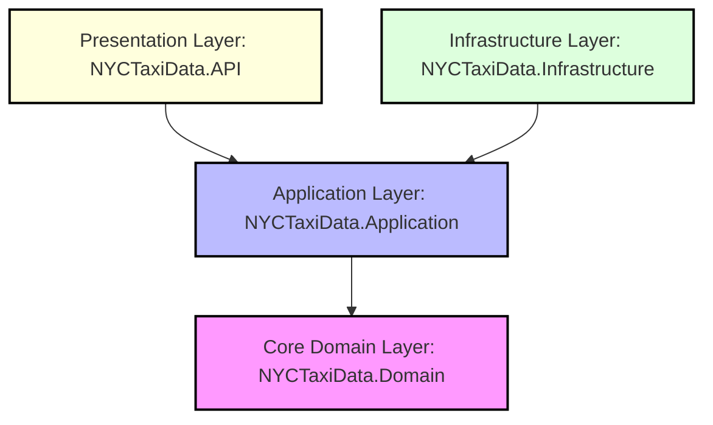

# NYC Taxi Data Platform — Technical Documentation

> **Repository**: https://github.com/Umar-Khattab/NYCTaxiData  
> **Framework**: .NET 10  
> **Architecture**: Clean Architecture with CQRS  
> **Last Analyzed**: May 2026

---

## Table of Contents

1. [Project Overview](#1-project-overview)
2. [Architecture Overview](#2-architecture-overview)
3. [Project Structure](#3-project-structure)
4. [Code Flow](#4-code-flow)
5. [Application flow and design details](#5-application-flow-and-design-details)
6. [Key Components Explanation](#6-key-components-explanation)
7. [Configuration & Setup](#7-configuration--setup)
8. [Dependencies & Integrations](#8-dependencies--integrations)
9. [Real-Time Simulation Engine](#9-real-time-simulation-engine)
10. [Best Practices & Observations](#10-best-practices--observations)

---

## 1. Project Overview

### Purpose

NYCTaxiData is a highly scalable, real-time backend platform and digital twin engine for NYC taxi fleet management and demand operations. Built on **.NET 10** using a strict **Clean Architecture** model, the platform leverages **feature-first CQRS**, a custom 11-stage **MediatR middleware pipeline**, and **SignalR WebSockets** for live event streaming.

The system is equipped with a faster-than-real-time (FTRT) operational simulation engine, geographic geo-spatial metrics calculators, external AI forecasting clients with automatic resilience retry policies, and an interactive React 19 TypeScript monitoring dashboard.


### Main Features

| Module | Description |
|--------|-------------|
| **Authentication & Identity** | Multi-role authentication (Driver, Manager, Admin) with JWT tokens, OTP verification via WhatsApp, password reset, and role-based access control |
| **Trip Management** | Full CRUD for trips, trip lifecycle (start/end), manual dispatch, live dispatch feed, trip history, and soft-delete support |
| **Driver Management** | Driver registration, profile management, real-time status updates (Available/On_Trip/Offline), shift statistics, and offline data sync |
| **Zone Analytics** | Geographic zone management, heatmap data, demand/revenue statistics, peak hours analysis, zone comparisons, and trend tracking |
| **AI Predictions** | 15-minute and 6-hour demand forecasting, ETA prediction, revenue prediction, stock-out probability, and vehicle repositioning optimization |
| **Simulation Engine** | Faster-than-real-time (FTRT) operational simulation with configurable speed factors, real-time streaming via SignalR, and what-if scenario modeling |
| **Real-Time Communication** | SignalR-powered live tracking hub, dispatch hub for driver-manager coordination, and simulation event streaming |
| **Analytics Dashboard** | KPI aggregation, demand velocity charts, system threshold configuration, and operational metrics |

### Technologies Used

| Category | Technology |
|----------|------------|
| **Runtime** | .NET 10 |
| **Web Framework** | ASP.NET Core 10 with OpenAPI |
| **Database** | PostgreSQL 15+ (via Supabase) |
| **ORM** | Entity Framework Core 10 |
| **Real-Time** | SignalR |
| **Architecture** | MediatR (CQRS), Clean Architecture |
| **Validation** | FluentValidation |
| **Mapping** | AutoMapper |
| **Resilience** | Polly (retry policies) |
| **Caching** | Distributed Memory Cache / Redis-ready |
| **Authentication** | JWT Bearer tokens, BCrypt password hashing |
| **External Communication** | Twilio WhatsApp API |
| **CI/CD** | GitHub Actions |
| **Frontend Companion** | React 19 + TypeScript simulation dashboard |

---

## 2. Architecture Overview

### Architecture Style

The project strictly follows **Clean Architecture** with **CQRS (Command Query Responsibility Segregation)** implemented via the MediatR library. The architecture enforces that dependencies flow only inward, with the Domain layer at the center having zero external dependencies.



### Layer Responsibilities

#### Domain Layer (Core)
- Defines pure business entities with no framework dependencies
- Declares repository contracts via interfaces
- Houses the Specification pattern abstractions
- Contains domain-specific enums and value objects
- Has zero external package dependencies beyond EF Core (for navigation properties only)

#### Application Layer
- Organizes all business logic into feature-based CQRS modules
- Each feature contains its own Commands, Queries, Handlers, and Validators
- Defines cross-cutting pipeline behaviors (11 behaviors total)
- Declares service interfaces that infrastructure must implement
- Uses DTOs to deculate API contracts from domain entities
- Contains AutoMapper profiles for entity-to-DTO transformations

#### Infrastructure Layer
- Implements all data persistence via EF Core DbContext
- Provides concrete implementations for all domain-defined interfaces
- Integrates external services (Twilio, AI prediction HTTP client)
- Contains the entire simulation engine subsystem
- Handles cross-cutting concerns: caching, JWT generation, auditing
- Manages database interceptors for audit trails and entity tracking

#### API Layer (Presentation)
- Exposes RESTful endpoints through attribute-routed controllers
- Hosts four SignalR hubs for real-time communication
- Configures middleware pipeline (exception handling, auth, CORS)
- Wires dependency injection for all layers
- Serves as the composition root at application startup

### Dependency Direction

Dependencies strictly flow inward:
- **API** references Application and Infrastructure
- **Infrastructure** references Application and Domain
- **Application** references Domain only
- **Domain** references nothing (pure)

### Design Patterns Used

| Pattern | Implementation |
|---------|---------------|
| **CQRS** | Separate Command and Query handlers via MediatR |
| **Repository Pattern** | Generic repository `IGenericRepository<T>` with specification support |
| **Unit of Work** | `IUnitOfWork` coordinating multiple repositories with transaction support |
| **Specification Pattern** | `ISpecification<T>` for encapsulating query criteria with includes, ordering, and paging |
| **Pipeline Behavior** | 11 MediatR pipeline behaviors for cross-cutting concerns |
| **Result Pattern** | `Result<T>` and `Result` types for explicit success/failure handling |
| **Marker Interfaces** | `ICacheableQuery`, `IIdempotentCommand`, `ITransactionalCommand`, `ISecureRequest` |
| **Dependency Injection** | Constructor injection throughout all layers |
| **Singleton + Scoped Services** | Appropriate lifetimes for DbContext, repositories, and stateful services |

---

## 3. Project Structure

```
NYCTaxiData/
├── NYCTaxiData.slnx                          # Solution file (SDK-style)
│
├── NYCTaxiData.Domain/                       # CORE DOMAIN LAYER
│   ├── Entities/                             # Business entities (40+ tables)
│   │   ├── Trip.cs, Driver.cs, Zone.cs
│   │   ├── User.cs, User1.cs, Manager.cs
│   │   ├── Identity.cs, Session.cs, RefreshToken.cs
│   │   ├── Location.cs, DailyStat.cs
│   │   └── ... (storage, OAuth, MFA entities)
│   ├── Enums/
│   │   ├── CurrentStatus.cs                  # Driver: Available, On_Trip, Offline
│   │   └── UserRole.cs                       # Driver, Manager
│   ├── Interfaces/
│   │   ├── IGenericRepository.cs             # Repository contract
│   │   ├── IUnitOfWork.cs                    # UoW contract
│   │   ├── IAuditableEntity.cs               # Audit tracking
│   │   ├── IConcurrentEntity.cs              # Optimistic concurrency
│   │   ├── ISoftDeletable.cs                 # Soft delete marker
│   │   └── Specifications/
│   │       └── ISpecification.cs             # Spec pattern interface
│   ├── Specifications/                       # Concrete specifications
│   │   ├── BaseSpecifications.cs
│   │   ├── Users/                            # User-related specs
│   │   ├── Drivers/                          # Driver-related specs
│   │   ├── SpecificationsTrip/               # Trip-related specs
│   │   └── Managers/                         # Manager-related specs
│   └── DTOs/                                 # Domain-level DTOs
│       ├── CommonDtos.cs
│       ├── DemandPredictionDtos.cs
│       └── SimulationDtos.cs
│
├── NYCTaxiData.Application/                  # APPLICATION LAYER
│   ├── Features/                             # Feature-first CQRS modules
│   │   ├── Auth/                             # Login, Register, OTP, Password Reset
│   │   ├── Drivers/                          # Driver CRUD, status, sync
│   │   ├── Trips/                            # Trip lifecycle, dispatch, analytics
│   │   ├── Zones/                            # Zone queries and analytics
│   │   ├── AI/                               # AI prediction commands
│   │   └── Analytics/                        # Dashboard KPIs and charts
│   ├── Behaviors/                            # 11 MediatR pipeline behaviors
│   │   ├── ExceptionHandlingBehavior.cs
│   │   ├── MetricsBehavior.cs
│   │   ├── PerformanceBehavior.cs
│   │   ├── LoggingBehavior.cs
│   │   ├── AuthorizationBehavior.cs
│   │   ├── ValidationBehavior.cs
│   │   ├── CachingBehavior.cs
│   │   ├── IdempotencyBehavior.cs
│   │   ├── RetryBehavior.cs
│   │   ├── TimeoutBehavior.cs
│   │   └── TransactionBehavior.cs
│   ├── Common/
│   │   ├── Interfaces/                       # Service interfaces
│   │   │   ├── IAiPredictionService.cs
│   │   │   ├── ICurrentUserService.cs
│   │   │   ├── IApplicationDbContext.cs
│   │   │   ├── IUnitOfWork.cs
│   │   │   ├── IIdempotencyService.cs
│   │   │   ├── IDispatchNotificationService.cs
│   │   │   ├── Services/                     # External service interfaces
│   │   │   │   ├── ICacheService.cs
│   │   │   │   ├── IJwtTokenService.cs
│   │   │   │   └── ISmsService.cs
│   │   │   └── MarkerInterfaces/             # Pipeline routing markers
│   │   │       ├── ICacheableQuery.cs
│   │   │       ├── IIdempotentCommand.cs
│   │   │       ├── ITransactionalCommand.cs
│   │   │       └── ISecureRequest.cs
│   │   ├── Exceptions/                       # Domain exceptions
│   │   ├── Models/
│   │   │   └── PaginatedList.cs              # Pagination wrapper
│   │   ├── Mappings/                         # AutoMapper profiles
│   │   └── Plumping/
│   │       └── Result.cs                     # Result pattern implementation
│   ├── DTOs/                                 # Application DTOs
│   │   ├── Identity/                         # Auth DTOs
│   │   ├── Trip/                             # Trip DTOs
│   │   ├── Zone/                             # Zone DTOs
│   │   └── Tracking/                         # Real-time tracking DTOs
│   ├── Simulation/
│   │   └── Models/
│   │       └── SimulationModels.cs           # Simulation state models
│   └── DependencyInjection.cs                # Application DI registration
│
├── NYCTaxiData.Infrastructure/               # INFRASTRUCTURE LAYER
│   ├── Data/
│   │   ├── Contexts/
│   │   │   ├── TaxiDbContext.cs              # Main EF Core context
│   │   │   └── AiDbContext.cs                # AI-specific context (reserved)
│   │   ├── Repository/
│   │   │   └── GenericRepository.cs          # IGenericRepository<T> implementation
│   │   └── Initializers/
│   │       └── DbInitializers.cs
│   ├── Interceptors/
│   │   ├── AuditableEntityInterceptor.cs     # Auto-sets CreatedAt/UpdatedAt
│   │   ├── AuditLogInterceptor.cs            # Logs entity changes
│   │   └── CurrentUserService.cs             # Extracts current user from HTTP context
│   ├── Services/
│   │   ├── JwtTokenService.cs                # JWT generation
│   │   ├── CacheService.cs                   # Distributed caching
│   │   ├── IdempotencyService.cs             # Duplicate request detection
│   │   ├── AiPredictionService.cs            # HTTP client for ML service
│   │   ├── DailyAggregationService.cs        # Aggregates daily statistics
│   │   ├── UnitOfWork.cs                     # IUnitOfWork implementation
│   │   ├── SpecificationEvaluator.cs         # Spec-to-IQueryable compiler
│   │   └── Twilio/
│   │       ├── WhatsAppSmsService.cs         # OTP via WhatsApp
│   │       └── TwilioSettings.cs
│   ├── Simulation/                           # Simulation engine subsystem
│   │   ├── SimulationOrchestrator.cs         # Main simulation loop
│   │   ├── SimulationStateManager.cs         # State initialization & transitions
│   │   ├── SimulationRuleEngine.cs           # Business rules for relocations
│   │   ├── SimulationFeatureLoader.cs        # Loads zone features from DB
│   │   ├── SimulationInferenceClient.cs      # Calls AI service during sim
│   │   ├── SimulationResultStore.cs          # In-memory tick storage
│   │   └── SimulationOptions.cs              # Configuration options
│   ├── Workers/
│   │   └── DailyAggregationWorker.cs         # Background statistics aggregation
│   └── DependencyInjection.cs                # Infrastructure DI registration
│
├── NYCTaxiData.API/                          # PRESENTATION LAYER
│   ├── Controllers/
│   │   ├── Base/
│   │   │   └── BaseController.cs             # Common response patterns
│   │   ├── AuthController.cs
│   │   ├── TripsController.cs
│   │   ├── ZonesController.cs
│   │   ├── DriversController.cs
│   │   ├── AiController.cs
│   │   ├── AnalyticsController.cs
│   │   ├── SimulationController.cs
│   │   └── AdminController.cs
│   ├── Hups/                                 # SignalR Hubs
│   │   ├── TaxiHub.cs                        # General taxi coordination
│   │   ├── LiveTrackingHub.cs               # GPS tracking & driver status
│   │   ├── Dispatch/
│   │   │   ├── DispatchHub.cs               # Driver dispatch accept/reject
│   │   │   └── DispatchNotification.cs      # Notification service
│   │   └── Simulation/
│   │       ├── SimulationHub.cs             # Simulation control via WebSockets
│   │       └── SimulationEventStreamer.cs   # Broadcasts sim events
│   ├── MiddleWares/
│   │   └── GlobalExceptionHandler.cs        # IExceptionHandler implementation
│   ├── Extensions/
│   │   ├── SignalRJwtExtension.cs           # JWT auth for SignalR
│   │   └── QueryableExtensions.cs
│   ├── Contracts/
│   │   └── APIResponse.cs                   # Unified API response wrapper
│   ├── Program.cs                           # Application entry point
│   └── appsettings.json / appsettings.Development.json
│
├── simulation-dashboard/                    # React 19 + TypeScript frontend
├── .github/
│   ├── workflows/dotnet.yml                 # CI/CD pipeline
│   └── copilot-instructions.md              # AI coding assistant rules
├── README.md
└── COMPLETE_PROJECT_CONTEXT.md
```

---

## 4. Code Flow

### End-to-End Request Lifecycle

#### Example: Starting a Trip (Command Flow)

```
┌─────────────┐     ┌──────────────┐     ┌──────────────────────────────────────────┐
│   Client    │────▶│  POST        │────▶│  TripsController.StartTrip()             │
│   (Driver   │     │  /api/v1/    │     │  → Creates StartTripCommand              │
│    App)     │     │  trips/start │     │  → Sends via Mediator                    │
└─────────────┘     └──────────────┘     └──────────────────────────────────────────┘
                                                      │
                                           ┌──────────▼──────────┐
                                           │  MediatR Pipeline   │
                                           │  (11 Behaviors)     │
                                           │                     │
                                           │  1. ExceptionHandling│
                                           │  2. Metrics         │
                                           │  3. Performance     │
                                           │  4. Logging         │
                                           │  5. Authorization   │
                                           │  6. Validation      │
                                           │  7. Caching         │
                                           │  8. Idempotency     │
                                           │  9. Retry           │
                                           │  10. Timeout        │
                                           │  11. Transaction    │
                                           └──────────┬──────────┘
                                                      │
                                           ┌──────────▼──────────┐
                                           │ StartTripCommand    │
                                           │    Handler          │
                                           │                     │
                                           │ → Gets Trip via UoW │
                                           │ → Validates driver  │
                                           │ → Updates entities  │
                                           │ → Saves via UoW     │
                                           └──────────┬──────────┘
                                                      │
                                           ┌──────────▼──────────┐
                                           │   Result<TripStart  │
                                           │      ResultDto>     │
                                           │   → Controller maps │
                                           │     to ApiResponse  │
                                           └─────────────────────┘
```

#### Example: Getting Zone Statistics (Query Flow)

```
┌─────────────┐     ┌──────────────┐     ┌──────────────────────────────────────────┐
│   Client    │────▶│  GET         │────▶│  ZonesController.GetZoneStatistics()     │
│  (Dashboard)│     │  /api/v1/    │     │  → Creates GetZoneStatisticsQuery        │
│             │     │  zones/stats │     │  → Sends via Mediator                    │
└─────────────┘     └──────────────┘     └──────────────────────────────────────────┘
                                                      │
                                           ┌──────────▼──────────┐
                                           │  MediatR Pipeline   │
                                           │                     │
                                           │  (Behaviors 1-6,    │
                                           │   9-10 execute;     │
                                           │   Caching checks    │
                                           │   ICacheableQuery)  │
                                           └──────────┬──────────┘
                                                      │
                                           ┌──────────▼──────────┐
                                           │ GetZoneStatistics   │
                                           │    QueryHandler     │
                                           │                     │
                                           │ → Queries via UoW   │
                                           │ → Applies specs     │
                                           │ → Maps to DTO       │
                                           └──────────┬──────────┘
                                                      │
                                           ┌──────────▼──────────┐
                                           │   Result<T> returned│
                                           │   to Controller     │
                                           └─────────────────────┘
```

### Interaction Between Layers

| Flow Direction | Mechanism | Example |
|---------------|-----------|---------|
| API → Application | MediatR `ISender.Send()` | Controller sends Command/Query |
| Application → Domain | Direct class references | Handler uses `Trip` entity |
| Application → Infrastructure | Interface contracts | Handler uses `IUnitOfWork` |
| Infrastructure → Domain | Interface implementation | `GenericRepository<T>` implements `IGenericRepository<T>` |
| API → Infrastructure | DI registration only | `Program.cs` calls `AddInfrastructureServices()` |

### SignalR Real-Time Flow

1. **Driver connects** → `LiveTrackingHub.OnConnectedAsync()` adds to "Drivers" group
2. **Driver sends GPS** → `UpdateLocation()` broadcasts to "Managers" group
3. **Manager dispatches** → `DispatchHub` sends command to specific driver
4. **Driver responds** → `AcceptDispatch()` or `RejectDispatch()` notifies managers
5. **Simulation events** → `SimulationHub` streams ticks to all connected clients

---

## 5. Application flow And design details

### Key Behaviors Highlighted

*   **`PerformanceBehavior<TRequest, TResponse>`**:
    *   Detects operations running slower than targets (Queries: 500ms, Commands: 1000ms).
    *   Tracks execution history in a thread-safe sliding window (100 measurements).
    *   Monitors relative performance degradation (triggering warnings upon a 20% latency increase).
    *   Exposes runtime query functions (`GetSlowOperations()`, `GetDegradingOperations()`, `GetPerformanceHistory()`).
*   **Pipeline Markers**: Request routing is controlled dynamically through marker interfaces:
    *   `ISecureRequest`: Intercepted by `AuthorizationBehavior`.
    *   `IIdempotentCommand`: Intercepted by `IdempotencyBehavior` to eliminate duplicate writes.
    *   `ICacheableQuery`: Intercepted by `CachingBehavior` for instant response delivery.
    *   `ITransactionalCommand`: Triggers `TransactionBehavior` to run database commits inside atomic operations.

---

## 🗄️ Database & Schema Design

Database management utilizes PostgreSQL via Entity Framework Core. Entity definitions are segmented across core domains:

| Domain | Key Entities | Purpose |
| :--- | :--- | :--- |
| **Identity & Users** | `User`, `Manager`, `Driver`, `Session`, `RefreshToken`, `OneTimeToken` | Implements authentication, manager profiles, driver tracking, active web/app sessions, OTP, and claims. |
| **Operational Dispatch** | `Trip`, `Zone`, `Location` | Manages live passenger trips, structural zone boundaries, coordinates, and physical pickup/dropoff metrics. |
| **Observability** | `AuditLogEntry`, `SchemaMigration` | Intercepts operations to capture creation, updating, and modification footprints. |
| **System Simulations** | `Simulationrequest`, `Simulationresult` | Saves historical operational digital-twin scenarios, inputs, execution steps, and resulting ticks. |
| **ML & AI Analytics** | `Weathersnapshot`, `Demandprediction`, `VectorIndex`, `BucketsAnalytic` | Drives forecast calculations, geo-spatial vectors, and indices mapping historical operational trends. |
| **S3 Storage Management**| `Bucket`, `Object`, `S3MultipartUpload`, `S3MultipartUploadsPart` | Coordinates secure multi-part file uploads and assets mapping. |

### EF Core Interceptors

1.  **`AuditableEntityInterceptor`**: Intercepts `SaveChanges` to automatically populate base properties (`CreatedAt`, `CreatedBy`, `LastModifiedAt`, `LastModifiedBy`) on entities implementing `IAuditableEntity`.
2.  **`AuditLogInterceptor`**: Automatically logs database modifications to an `AuditLogEntry` table to capture changes securely.

---

## 📡 SignalR Hubs & WebSockets

Live data-streaming operates over four specific SignalR hubs, accepting JWT tokens passed via query-string parameters (`access_token`):

*   **`TaxiHub` (`/hubs/taxi`)**: Role-based routing that handles group registration, live driver coordinates broadcasting, operational dispatch orders, and state alerts.
*   **`LiveTrackingHub` (`/hubs/tracking`)**: Pushes raw real-time tracking points, active fleets status updates, and location changes.
*   **`DispatchHub` (`/hubs/dispatch`)**: Manages coordination channels between dispatchers and drivers, handling trip broadcasts, dispatcher actions, driver accepts/declines, and pickup/completion states.
*   **`SimulationHub` (`/hubs/simulation`)**: Broadcasts digital-twin ticks (`SimulationTick`) and engine configuration statuses (`SimulationStatus`) to visualization components.

---

## 6. Key Components Explanation

### Services (Interface Definitions)

| Service | Layer | Role |
|---------|-------|------|
| `IAiPredictionService` | Application | Contracts for ML predictions (demand, ETA, revenue, stock-out, repositioning) |
| `IJwtTokenService` | Application | Token generation contract |
| `ICacheService` | Application | Distributed caching contract |
| `ISmsService` | Application | OTP delivery contract (WhatsApp) |
| `IIdempotencyService` | Application | Duplicate request prevention contract |
| `ICurrentUserService` | Application | Extracts authenticated user context |
| `IDispatchNotificationService` | Application | Real-time dispatch notification contract |
| `IDailyAggregationService` | Application | Daily statistics computation contract |

### Infrastructure Service Implementations

| Implementation | Description |
|---------------|-------------|
| `AiPredictionService` | HTTP client communicating with Python FastAPI ML service. Uses Polly retry policies. Handles demand, ETA, revenue, stock-out predictions and repositioning optimization |
| `JwtTokenService` | Generates JWT tokens with phone, role, and full name claims. 24-hour expiry |
| `CacheService` | Wraps `IDistributedCache` for key-value operations with TTL support |
| `WhatsAppSmsService` | Integrates Twilio API for OTP delivery via WhatsApp messages |
| `IdempotencyService` | Stores request fingerprints in distributed cache to prevent duplicate processing |
| `CurrentUserService` | Reads claims from `HttpContext.User` to identify the authenticated user |
| `DailyAggregationService` | Computes daily statistics: total trips, revenue, active drivers, average fare, cancelled trips |

### Interfaces (Domain Contracts)

| Interface | Purpose |
|-----------|---------|
| `IGenericRepository<T>` | Universal data access contract with specification support, pagination, and bulk operations |
| `IUnitOfWork` | Coordinates multiple repositories, provides transaction boundary with automatic rollback |
| `ISpecification<T>` | Encapsulates query criteria, includes, ordering, and paging parameters |
| `IAuditableEntity` | Marks entities for automatic CreatedAt/UpdatedAt tracking |
| `IConcurrentEntity` | Marks entities for optimistic concurrency control |
| `ISoftDeletable` | Marks entities for soft-delete (DeletedAt timestamp) |

### Repositories

| Repository | Description |
|------------|-------------|
| `GenericRepository<T>` | Single implementation serving all entity types. Supports: specification-based queries, expression-based filtering, pagination, bulk CRUD, include chains |
| `UnitOfWork` | Lazy-initializes repositories, manages `DbContext` lifetime, provides `ExecuteInTransactionAsync` with execution strategy retry |

### Specifications

Specifications encapsulate query logic into reusable, composable objects:

| Specification Category | Examples |
|----------------------|----------|
| **Users** | `UserByIdSpec`, `UserForLoginSpec`, `UserByPhoneSpec`, `UserPhoneExistsSpec` |
| **Drivers** | `DriverByIdSpec`, `AvailableDriversSpec`, `DriverByStatusSpec`, `DriverLicenseExistsSpec` |
| **Trips** | `TripByIdSpec`, `TripHistorySpec`, `DispatchFeedSpec`, `ActiveTripsSpec`, `TripsInDateRangeSpec` |
| **Managers** | `ManagerByIdSpec`, `ManagerByEmployeeIdSpec`, `ManagerEmployeeIdExistsSpec` |

### Middleware

| Middleware | Role |
|------------|------|
| `GlobalExceptionHandler` | Implements `IExceptionHandler` to catch all unhandled exceptions, maps domain exceptions to HTTP status codes, returns structured `ApiResponse<T>` with error details |

### SignalR Hubs

| Hub | Purpose | Groups |
|-----|---------|--------|
| `TaxiHub` | General coordination, trip status updates, location updates | Drivers, Managers |
| `LiveTrackingHub` | Real-time GPS tracking, driver status monitoring | Drivers, Managers |
| `DispatchHub` | Dispatch accept/reject, arrival/completion notifications | Drivers, Managers |
| `SimulationHub` | Simulation control (start/pause/resume/speed) and status | All clients |

### Pipeline Behaviors (11-Stage MediatR Pipeline)

Behaviors execute in this strict order (outermost to innermost):

| Order | Behavior | Trigger Condition | Purpose |
|-------|----------|-------------------|---------|
| 1 | `ExceptionHandlingBehavior` | All requests | Global exception catching and formatting |
| 2 | `MetricsBehavior` | All requests | Execution counting and operation metrics |
| 3 | `PerformanceBehavior` | All requests | Latency monitoring and degradation detection |
| 4 | `LoggingBehavior` | All requests | Structured logging of request parameters |
| 5 | `AuthorizationBehavior` | `ISecureRequest` marker | JWT claim validation and role checking |
| 6 | `ValidationBehavior` | All requests | FluentValidation rule execution |
| 7 | `CachingBehavior` | `ICacheableQuery` marker | Cache hit check and response caching |
| 8 | `IdempotencyBehavior` | `IIdempotentCommand` marker | Duplicate command detection |
| 9 | `RetryBehavior` | All requests | Transient failure retry (3 attempts) |
| 10 | `TimeoutBehavior` | All requests | Execution deadline enforcement |
| 11 | `TransactionBehavior` | `ITransactionalCommand` marker | EF Core database transaction wrapping |

### Marker Interfaces

| Marker Interface | Behavior That Consumes It | Use Case |
|-----------------|--------------------------|----------|
| `ISecureRequest` | `AuthorizationBehavior` | Endpoints requiring authentication |
| `ICacheableQuery` | `CachingBehavior` | Query responses that can be cached |
| `IIdempotentCommand` | `IdempotencyBehavior` | Commands that must not execute twice (e.g., payments) |
| `ITransactionalCommand` | `TransactionBehavior` | Commands requiring atomic database operations |

### Simulation Engine Subsystem

| Component | Responsibility |
|-----------|---------------|
| `SimulationOrchestrator` | Main loop: starts/stops/pauses/resumes simulation, manages timing, broadcasts ticks |
| `SimulationStateManager` | Initializes simulation state, applies prediction results, builds tick snapshots |
| `SimulationRuleEngine` | Computes optimal driver relocations between zones based on supply-demand imbalance |
| `SimulationFeatureLoader` | Loads hourly zone features from the database for simulation input |
| `SimulationInferenceClient` | Calls the AI prediction service during each simulation step |
| `SimulationResultStore` | In-memory storage of simulation ticks for playback and analysis |
| `SimulationEventStreamer` | Broadcasts simulation events via SignalR to connected dashboard clients |

---

## 7. Configuration & Setup

### Clone the Repository

```bash
git clone https://github.com/Umar-Khattab/NYCTaxiData.git
cd NYCTaxiData
```

### Prerequisites

- **.NET 10 SDK** (the project targets `net10.0`)
- **PostgreSQL 15+** database (or a Supabase project)
- **Optional**: Python FastAPI ML service for AI predictions (runs on port 8000)
- **Optional**: Redis for distributed caching

### Environment Setup

1. **Configure the Database Connection**  
   Edit `NYCTaxiData.API/appsettings.Development.json`:

   ```json
   {
     "ConnectionStrings": {
       "DefaultConnection": "Host=<host>;Port=5432;Database=postgres;Username=<user>;Password=<password>;SSL Mode=Require;Trust Server Certificate=true"
     }
   }
   ```

2. **Configure JWT Authentication**

   ```json
   {
     "Jwt": {
       "Secret": "Your_Super_Secret_Key_At_Least_32_Chars_Long!",
       "Issuer": "NYCTaxiData",
       "Audience": "NYCTaxiData"
     }
   }
   ```

3. **Configure WhatsApp OTP (Twilio)**

   ```json
   {
     "WhatsApp": {
       "InstanceId": "YOUR_INSTANCE_ID",
       "Token": "YOUR_WHATSAPP_TOKEN"
     }
   }
   ```

4. **Configure ML Service (for AI predictions)**

   ```json
   {
     "AiService": {
       "BaseUrl": "http://127.0.0.1:8000/"
     }
   }
   ```

5. **Configure CORS (for simulation dashboard)**

   ```json
   {
     "Cors": {
       "AllowedOrigins": ["http://localhost:5173"]
     }
   }
   ```

### Configuration Files

| File | Purpose |
|------|---------|
| `appsettings.json` | Production configuration |
| `appsettings.Development.json` | Development overrides (connection strings, secrets) |
| `.github/copilot-instructions.md` | AI coding assistant guidelines |

### Run the Project

```bash
# Restore dependencies
dotnet restore

# Build the solution
dotnet build

# Run the API (from the API project directory)
cd NYCTaxiData.API
dotnet run

# Or run with watch mode for development
dotnet watch run
```

The API will be available at:
- **HTTPS**: `https://localhost:7001` (or similar)
- **HTTP**: `http://localhost:5001` (or similar)
- **OpenAPI**: `/openapi/v1.json`

### SignalR Hub Endpoints

| Hub | Endpoint |
|-----|----------|
| TaxiHub | `/hubs/taxi` |
| LiveTrackingHub | `/hubs/tracking` |
| DispatchHub | `/hubs/dispatch` |
| SimulationHub | `/hubs/simulation` |

---

## 8. Dependencies & Integrations

### Databases

| Database | Provider | Usage |
|----------|----------|-------|
| **PostgreSQL** | Npgsql.EntityFrameworkCore.PostgreSQL (10.0.0) | Primary database for all entities |
| **Supabase** | PostgreSQL-compatible hosted instance | Current cloud deployment target |

**Database Features Used**:
- PostgreSQL enums (mapped via EF Core `HasPostgresEnum`)
- PostGIS extension for geographic data
- pgcrypto extension for UUID generation
- Multiple schemas: `auth`, `storage`
- Connection resiliency with retry policies (5 retries, 30s max delay)

### External APIs & Services

| Service | Integration | Purpose |
|---------|------------|---------|
| **Python FastAPI ML Service** | HTTP client with Polly retry | AI predictions: demand, ETA, revenue, stock-out |
| **Twilio WhatsApp** | REST API via dedicated service | OTP delivery to drivers and managers |
| **Supabase Auth** | Schema-compatible user tables | OAuth, MFA, SSO infrastructure |

### Third-Party NuGet Packages

| Package | Version | Purpose |
|---------|---------|---------|
| `Microsoft.AspNetCore.Authentication.JwtBearer` | 10.0.6 | JWT authentication |
| `Microsoft.EntityFrameworkCore` | 10.0.5 | ORM |
| `Npgsql.EntityFrameworkCore.PostgreSQL` | 10.0.0 | PostgreSQL provider |
| `MediatR` | 14.1.0 | CQRS implementation |
| `FluentValidation.DependencyInjectionExtensions` | 12.1.1 | Input validation |
| `AutoMapper` | 16.1.1 | Object mapping |
| `Polly` / `Polly.Extensions.Http` | 8.6.6 / 3.0.0 | Resilience policies |
| `BCrypt.Net-Next` | 4.1.0 | Password hashing |
| `StackExchange.Redis` | 2.12.14 | Redis caching |
| `Twilio` | 7.14.3 | WhatsApp messaging |
| `System.IdentityModel.Tokens.Jwt` | 8.3.1 | JWT token handling |
| `Microsoft.AspNetCore.SignalR` | 1.2.9 | Real-time communication |
| `Portable.BouncyCastle` | 1.9.0 | Cryptographic operations |

---

## 9. 🎛️ Real-Time Simulation Engine

The platform features an advanced, multi-component **Faster-Than-Real-Time (FTRT) Operational Simulation Engine** enabling operators to simulate fleet operations, passenger demand, driver distributions, and predictive profit optimizations over customized time intervals.

```
                  ┌──────────────────────┐
                  │ SimulationHub        │
                  │ (SignalR WebSockets) │
                  └──────────▲───────────┘
                             │ (Broadcasts Ticks & Status)
  ┌──────────────────────────┴──────────────────────────────────────────┐
  │                        SimulationOrchestrator                       │
  │  ┌──────────────────────┐   ┌───────────────────┐   ┌────────────┐  │
  │  │ SimulationState      │   │ InferenceClient   │   │ RuleEngine │  │
  │  │ (Active Memory State)│   │ (Calls ML Server) │   │ (Rules)    │  │
  │  └──────────▲───────────┘   └─────────▲─────────┘   └──────┬─────┘  │
  └─────────────┼─────────────────────────┼────────────────────┼────────┘
                │                         │                    │
     [1] Loader loads           [2] Fetches demand     [3] Calculates trip
         features & seeds           forecasting &          & relocation
         starting conditions        ETA predictions        transitions
                │                         │                    │
  ┌─────────────┴──────────┐    ┌─────────┴─────────┐   ┌──────▼─────┐
  │ SimulationFeatureLoader│    │ Python ML Server  │   │ResultStore │
  └────────────────────────┘    └───────────────────┘   └────────────┘
```

### Core Architecture Components

*   **`SimulationFeatureLoader`**: Loads geographic features, weather indexes, and matrices to initialize starting conditions.
*   **`SimulationStateManager`**: Governs current state transitions, active driver assignments, zone passenger counts, and performance metrics.
*   **`SimulationRuleEngine`**: Calculates state changes step-by-step (e.g. processing relocations, active driver density shifts, and passenger pickups).
*   **`SimulationInferenceClient`**: Queries the Python ML server via HttpClient to integrate forecasting parameters dynamically.
*   **`SimulationResultStore`**: Appends database ticks and persists simulation run history to PostgreSQL database tables.
*   **`SimulationOrchestrator`**: Manages the running worker loop, handles thread-safe start, pause, resume, and stop controls, and paces ticks.
    *   *Faster-than-real-time pacing*: Paces tick durations according to speed factor config:
        $$\text{StepDuration} = \frac{3600 \text{ seconds}}{\text{SpeedFactor}}$$
        For instance, at $3600\text{x}$ speed, one simulated hour executes in exactly $1.0\text{ second}$ of real time.

---

## 10. Best Practices & Observations

### Good Design Decisions

1. **Clean Architecture Compliance**: The project strictly follows Clean Architecture principles. The Domain layer has zero external dependencies, and dependency direction is consistently inward.

2. **Feature-First Organization**: The Application layer organizes code by feature (Auth, Trips, Zones, AI) rather than by type, making the codebase highly navigable and scalable.

3. **Pipeline Behavior Pattern**: The 11-stage MediatR pipeline elegantly handles cross-cutting concerns without polluting business logic. Each behavior has a single responsibility.

4. **Marker Interface Pattern**: Using marker interfaces (`ICacheableQuery`, `IIdempotentCommand`, etc.) to opt behaviors into the pipeline is a clean, declarative approach.

5. **Result Pattern**: Explicit `Result<T>` types eliminate exception-based control flow and force callers to handle failures.

6. **Specification Pattern**: Query criteria are encapsulated in reusable, testable specification classes rather than scattered throughout handlers.

7. **Unit of Work with Transaction Support**: `ExecuteInTransactionAsync` handles nested transaction scenarios gracefully by detecting existing transactions.

8. **SignalR Hub Specialization**: Four dedicated hubs instead of one monolithic hub prevents coupling between unrelated real-time features.

9. **Simulation Engine Architecture**: The simulation subsystem follows a clean separation with distinct components for state management, rule evaluation, feature loading, and result storage.

10. **Polly Resilience**: HTTP calls to the ML service use Polly retry policies with exponential backoff, ensuring transient failures don't crash the system.

### Code Quality Observations

| Aspect | Observation |
|--------|-------------|
| **Consistency** | The codebase shows high consistency in naming conventions and patterns across all features |
| **Comments** | Mix of English and Arabic comments — recommend standardizing to English for international teams |
| **Configuration Security** | `appsettings.Development.json` contains hardcoded credentials (JWT secret, database password, WhatsApp token) — should use user secrets or environment variables |
| **Nullable Reference Types** | Enabled (`<Nullable>enable</Nullable>`), showing modern C# practices |
| **Implicit Usings** | Enabled (`<ImplicitUsings>enable</ImplicitUsings>`), reducing boilerplate |
| **CI/CD** | GitHub Actions workflow configured but targets .NET 8 instead of .NET 10 — needs updating |

### Working on those Improvements

1. **Credential Management**: Move all secrets from `appsettings.Development.json` to .NET User Secrets or environment variables. Currently, sensitive credentials are committed to the repository.

2. **CI/CD Pipeline Update**: The GitHub Actions workflow (`dotnet.yml`) specifies `dotnet-version: 8.0.x` but the project targets .NET 10. Update to match.

3. **Test Coverage**: No test projects are visible in the repository. Consider adding:
   - Unit tests for handlers and behaviors
   - Integration tests for database operations
   - SignalR hub tests
   - Simulation engine tests

4. **API Versioning**: While controllers use `[Route("api/v1/[controller]")]`, formal API versioning via `Asp.Versioning.Http` would provide better evolution support.

5. **Rate Limiting**: Consider adding ASP.NET Core rate limiting middleware for public endpoints, especially OTP and login endpoints.

6. **Health Checks**: Add `Microsoft.Extensions.Diagnostics.HealthChecks` for database, ML service, and external API connectivity monitoring.

7. **OpenAPI Documentation**: Controllers lack XML documentation comments and `[ProducesResponseType]` attributes on some endpoints, limiting the quality of generated OpenAPI specs.

8. **Logging Configuration**: Add structured logging with Serilog for production environments, with proper log levels and sinks.

9. **Database Migrations**: No EF Core Migrations folder is visible. The project uses `EnsureCreated` or manual schema management via Supabase. Consider formal migrations for schema evolution.

10. **Dead Code Removal**: Several empty folders exist in the Infrastructure project (`ExternalServices`, `Caching`, `Real-TimeCommunication`, `Persistence/Repositories`). Clean up or populate these.

11. **Duplicate Entities**: The `User` and `User1` entity duality suggests Supabase auth integration complexity. Consider a unified user model with clear documentation.

12. **SignalR Scale-Out**: The current SignalR implementation uses in-memory backplane. For production multi-instance deployments, configure Redis backplane.

13. **Simulation State Persistence**: The simulation stores results in memory. For long-running simulations, consider persisting ticks to the database.

---

> **Document End**  
> This documentation was generated through comprehensive analysis of the repository source code across all 18 branches, examining 398+ C# files, 4 project layers, and the complete commit history.
